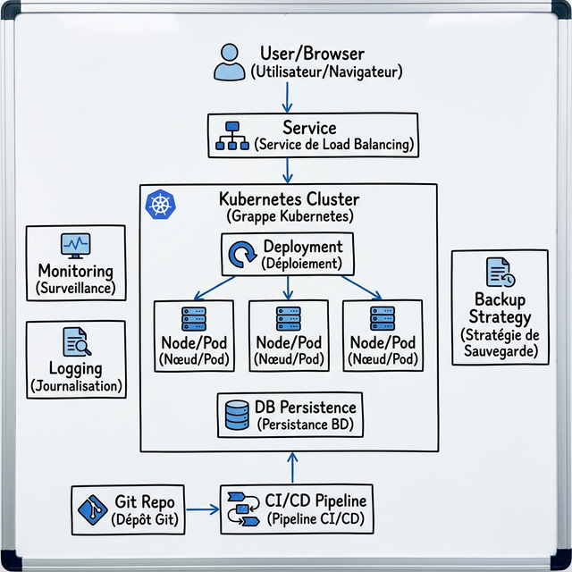

# Current System Problems (Problèmes du système actuel)

Cette conception présente plusieurs problèmes graves qui la rendent inadaptée à un environnement de production.

### Problem 1: Single Point of Failure and Lack of Persistence (Problème 1 : Point de défaillance unique et manque de persistance)
**What is the problem? (Quel est le problème ?)**
L'application (`quote-api`) et la base de données (`postgres`) s'exécutent dans le même conteneur au sein d'un seul Pod. De plus, il n'y a aucune mention de volumes de stockage persistants.

**Why does it matter? (Pourquoi est-ce important ?)**
Les conteneurs sont par nature éphémères. Dans un système de production, la persistance des données est critique, et la disponibilité de l'application ne devrait pas être liée à l'état du moteur de base de données.

**What failure or operational risk could it cause? (Quel échec ou risque opérationnel cela pourrait-il causer ?)**
Si l'application plante, la base de données tombe avec elle. Si le Pod est redémarré (par exemple, lors d'un redémarrage de nœud ou d'un nouveau déploiement), le conteneur de la base de données est détruit et recréé à partir de zéro, entraînant la perte complète et permanente de toutes les données utilisateur. Cela rend également impossible la mise à l'échelle de l'API indépendamment de la base de données.

### Problem 2: Plaintext Secrets (Problème 2 : Secrets en texte clair)
**What is the problem? (Quel est le problème ?)**
Les identifiants de la base de données (mots de passe, noms d'utilisateur) et tout autre jeton sensible sont stockés sous forme de variables d'environnement en texte clair.

**Why does it matter? (Pourquoi est-ce important ?)**
La sécurité en production exige le respect du principe du moindre privilège et une gestion stricte des secrets. Les variables d'environnement sont souvent enregistrées par les outils de surveillance du système ou les traqueurs d'erreurs, et toute personne ayant un accès en lecture au manifeste de déploiement du cluster peut les voir.

**What failure or operational risk could it cause? (Quel échec ou risque opérationnel cela pourrait-il causer ?)**
Si un acteur malveillant obtient ne serait-ce qu'un accès en lecture de bas niveau au cluster Kubernetes, ou si les variables d'environnement sont accidentellement affichées dans les journaux de l'application, les identifiants de la base de données seront exposés. Cela pourrait entraîner une grave violation de données ou une modification non autorisée.

### Problem 3: No Resource Management or Health Probes (Problème 3 : Pas de gestion des ressources ni de sondes de santé)
**What is the problem? (Quel est le problème ?)**
Le déploiement manque de demandes (`requests`) et de limites (`limits`) de ressources. De plus, aucune sonde de vitalité (`liveness`) ou de disponibilité (`readiness`) n'est configurée.

**Why does it matter? (Pourquoi est-ce important ?)**
Kubernetes a besoin de savoir de combien de mémoire et de CPU un Pod a besoin pour le planifier efficacement. Il doit également savoir si une application est réellement prête à servir du trafic ou si elle est entrée dans un état de blocage.

**What failure or operational risk could it cause? (Quel échec ou risque opérationnel cela pourrait-il causer ?)**
Sans sondes, Kubernetes dirigera le trafic vers le conteneur avant que l'API ou la base de données ne soit complètement initialisée, ce qui entraînera des erreurs 5xx immédiates pour les utilisateurs. Si l'application se bloque, elle ne sera pas redémarrée automatiquement. Sans limites de ressources, une fuite de mémoire dans `quote-api` pourrait consommer toute la RAM disponible sur le nœud unique, provoquant le crash du nœud entier.

---

# Production Architecture (Architecture de production)

Pour faire fonctionner ce système en production de manière fiable, nous avons conçu une architecture robuste qui élimine les points de défaillance uniques et assure la sécurité des données.

### Composants clés de la solution :

1.  **Application Deployment (Déploiement de l'application) :**
    *   L'API est gérée par un objet `Deployment` Kubernetes avec au moins 3 réplicas.
    *   **Multiple Replicas :** Assure la disponibilité même en cas de panne d'un pod ou d'un nœud.
2.  **Exposing the Application (Exposition de l'application) :** Un Service `ClusterIP` pour l'équilibrage de charge interne et un `Ingress` pour l'accès externe HTTPS.
3.  **PostgreSQL with Persistent Storage (PostgreSQL avec stockage persistant) :** Séparé de l'API

---

# Operational Strategy (Stratégie opérationnelle)

### How does the system scale? (Comment le système évolue-t-il ?)
Le design gère l'augmentation du trafic via le **Horizontal Pod Autoscaler (HPA)**. Kubernetes surveille l'utilisation du CPU et de la mémoire. Si la charge dépasse un seuil défini (ex: 70%), le HPA crée automatiquement de nouveaux réplicas de l'API `quote-api`. Au niveau de l'infrastructure, le **Cluster Autoscaler** peut ajouter des nœuds physiques si les ressources du cluster sont saturées.

### How are updates deployed safely? (Comment les mises à jour sont-elles déployées en toute sécurité ?)
Nous utilisons une stratégie de **RollingUpdate**. Lors d'une mise à jour :
*   Kubernetes lance un nouveau pod avec la nouvelle version.
*   Il attend que la **Readiness Probe** confirme que le nouveau pod est prêt.
*   Il ne supprime un ancien pod qu'une fois le nouveau opérationnel.
*   Avec `maxUnavailable: 0`, nous garantissons qu'il n'y a jamais de baisse de capacité pendant le déploiement.

### How are failures detected? (Comment les pannes sont-elles détectées ?)
Les pannes sont détectées via deux mécanismes de sondes (Probes) :
*   **Liveness Probe :** Vérifie si l'application est toujours "vivante". Si elle échoue (ex: deadlock), Kubernetes redémarre le conteneur.
*   **Readiness Probe :** Vérifie si l'application est capable de répondre aux requêtes (ex: connexion DB active). Si elle échoue, le pod est retiré de l'équilibrage de charge du Service pour éviter d'envoyer des erreurs aux utilisateurs.

### Which Kubernetes controllers handle recovery? (Quels contrôleurs Kubernetes gèrent la récupération ?)
*   **ReplicaSet Controller :** S'assure en permanence que le nombre de réplicas souhaité (ex: 3) est en cours d'exécution. Si un pod meurt, il en recrée un immédiatement.
*   **Deployment Controller :** Gère les transitions d'état pendant les mises à jour et orchestre les ReplicaSets.
*   **StatefulSet Controller :** Garantit la stabilité de l'identité et du stockage de la base de données PostgreSQL en cas de redémarrage.
*   **Node Controller :** Détecte si un nœud entier est défaillant et évacue les pods vers d'autres nœuds sains.

---

# Weakest Point (Point le plus faible)

Même avec une architecture prête pour la production, la **couche de base de données reste souvent le maillon faible**.

Si nous choisissons d'héberger PostgreSQL à l'intérieur du cluster Kubernetes au lieu d'utiliser une base de données gérée, la charge opérationnelle est massive. Gérer une base de données hautement disponible dans Kubernetes nécessite des opérateurs complexes, une gestion rigoureuse des volumes persistants et des tests de sauvegarde fréquents. Une défaillance au niveau du stockage pourrait encore entraîner des pertes de données catastrophiques si les procédures de récupération ne sont pas automatisées et testées.
